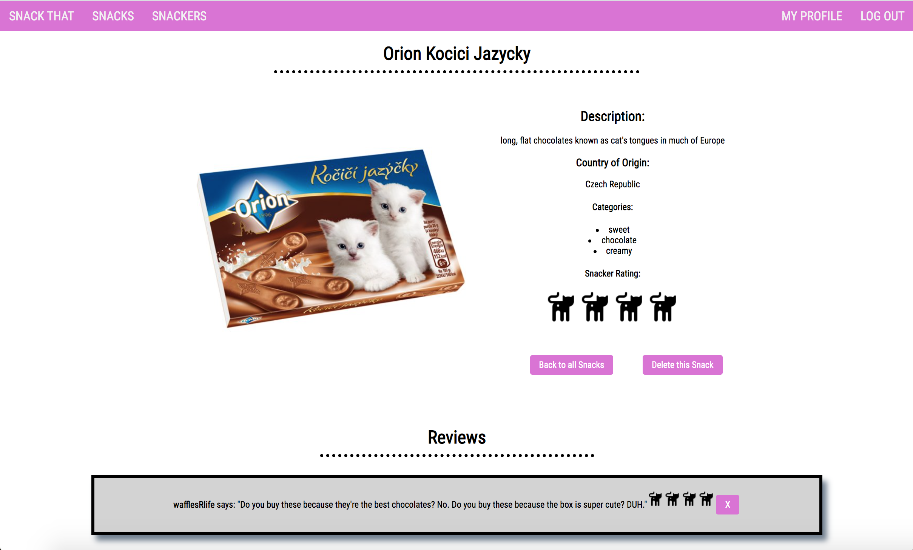

# Snack That

Snack That is a web application for serious snack lovers to log and review snack foods from around the world.

 

<a href="https://youtu.be/ktNNXO2ZyNU"><strong>Demo Video</strong></a>

This app is dependent on the Snack That API backend, to be run in conjunction: <a href='https://github.com/Waffles4Ransom/snack_that_backend'>https://github.com/Waffles4Ransom/snack_that_backend</a>

## Features 

- users can view snacks and snackers
- user must join to be able to add snacks and reviews
- built using React, Redux, thunk, React Router, HTML, CSS
- served by a Ruby on Rails API 

## Installation 

1. be sure to clone backend repo and run server 
2. clone this repo 
3. run `yarn start`

## Contributing 
This project is intended to be a safe, welcoming space for collaboration, and contributors are expected to adhere to the Contributor Covenant code of conduct.

## Acknowledgements
<a target="_blank" href="https://icons8.com/icons/set/cat-butt">Cat Butt icon</a> by <a target="_blank" href="https://icons8.com">Icons8</a>

Snack bag icon made by <a href="http://www.freepik.com/" title="Freepik">Freepik</a> from <a href="https://www.flaticon.com/" title="Flaticon">www.flaticon.com</a>

## Learn More

This project was bootstrapped with [Create React App](https://github.com/facebook/create-react-app).

You can learn more in the [Create React App documentation](https://facebook.github.io/create-react-app/docs/getting-started).

To learn React, check out the [React documentation](https://reactjs.org/).

